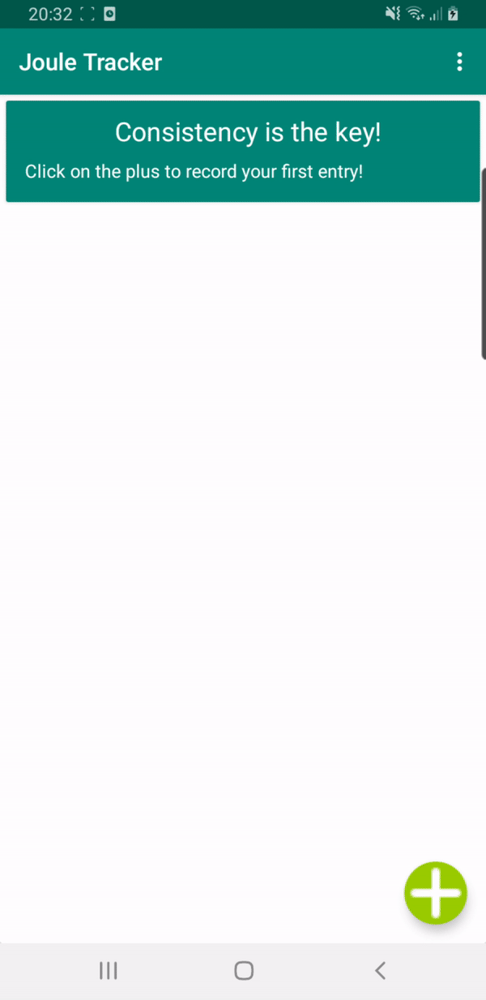

# JouleTracker
Android App that allows users to keep track of Energy Intake and Output. Users can look back at previous days like a Kilojoule dairy. 
The app also displays your average energy intake. Uses set their Intake based on meals/snacks eatten and their output based on physical
activity.

